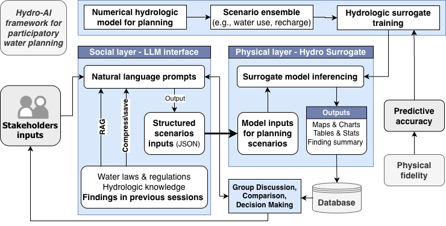
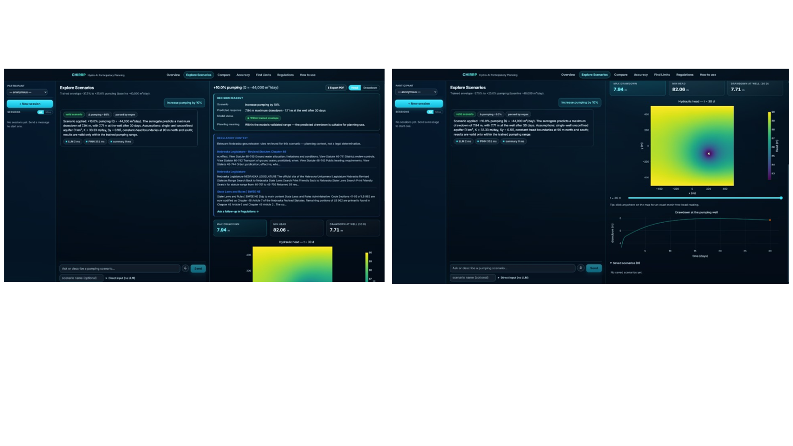
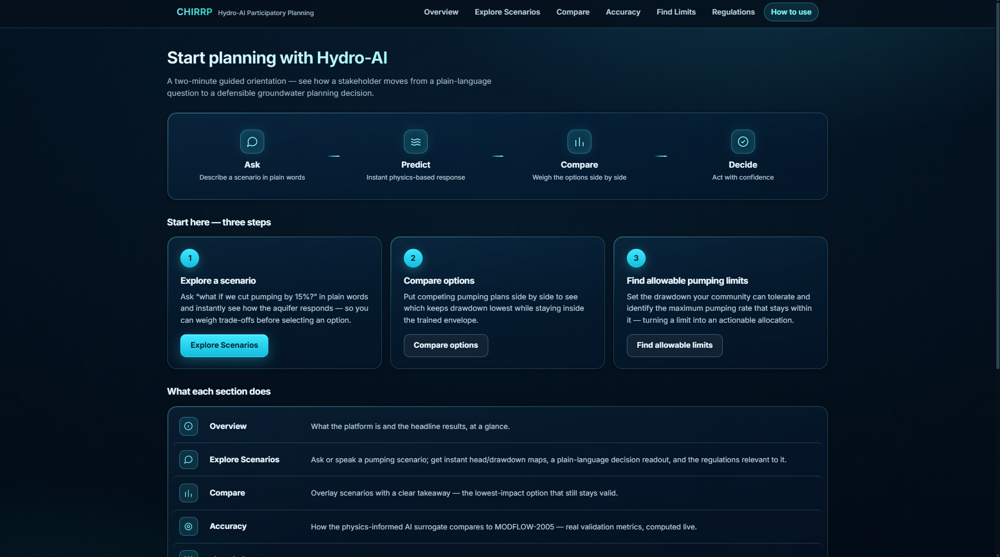
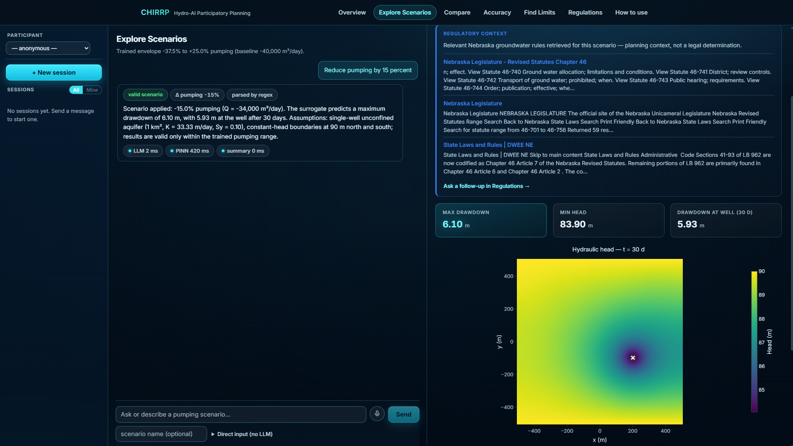

# CHIRRP — Hydro-AI Framework for Participatory Water Resources Planning

**Live demo:** https://morule-hydro.hf.space
(Space page / files / logs: https://huggingface.co/spaces/morule/hydro)

**Paper:** *An End-to-End Hydro-AI Framework for Next-generation Participatory
Water Resources Planning* — Ruopu Li, Michael Edidem, Pouria Kharazi, Hyungtak
Lee, Yididiya Nadew, Chris Quinn, Kofi Akamai, Steve Q. Hu.

CHIRRP couples a natural-language LLM interface (the paper's "social layer")
with a physics-informed neural network (PINN) surrogate of groundwater
drawdown (the "physical layer"), so a stakeholder can ask a plain-language
question ("reduce pumping by 15%") and get an instant, physically-grounded,
auditable prediction — cross-checked against a MODFLOW-2005 numerical model,
with regulation-grounded context pulled in via retrieval-augmented generation
(RAG). This repo is the code and artifacts behind the paper's Section 3 case
study and Appendix A.

<p align="center">
  
  <br><em>Figure 1 (paper) — dual-architecture overview: LLM social layer ↔ PINN physical layer.</em>
</p>

<p align="center">
  
  <br><em>Figure 2 (paper) — the implemented web application ("Explore Scenarios" page): a stakeholder's natural-language pumping request parsed into a validated scenario, with predicted drawdown, envelope-validity status, regulatory context, and the resulting head field.</em>
</p>

## How to use

The live app's own **"How to use"** page (top nav, right side) gives a
two-minute orientation. The workflow is **Ask → Predict → Compare → Decide**:
describe a scenario in plain words, get an instant physics-based response,
weigh options side by side, then act with confidence.

<p align="center">
  
  <br><em>The app's built-in "How to use" orientation page.</em>
</p>

**Three steps to get started:**
1. **Explore a scenario** — ask "what if we cut pumping by 15%?" in plain words and instantly see how the aquifer responds, so you can weigh trade-offs before selecting an option.
2. **Compare options** — put competing pumping plans side by side to see which keeps drawdown lowest while staying inside the trained envelope.
3. **Find allowable pumping limits** — set the drawdown your community can tolerate and identify the maximum pumping rate that stays within it, turning a limit into an actionable allocation.

**What each nav section does:**

| Section | Purpose |
|---|---|
| **Overview** | What the platform is and the headline results, at a glance. |
| **Explore Scenarios** | Ask or speak a pumping scenario; get instant head/drawdown maps, a plain-language decision readout, and the regulations relevant to it. |
| **Compare** | Overlay scenarios with a clear takeaway — the lowest-impact option that still stays valid. |
| **Accuracy** | How the physics-informed AI surrogate compares to MODFLOW-2005 — real validation metrics, computed live. |
| **Find Limits** | Goal-seek the maximum pumping rate that stays under a stakeholder-set drawdown threshold. |
| **Regulations** | RAG-grounded lookup of relevant Nebraska groundwater statutes and rules. |
| **How to use** | This orientation page. |

**Example live session** — a stakeholder asks to "Reduce pumping by 15 percent":
the app parses it (`Δ pumping -15%`, `parsed by regex`), reports the result
("−15.0% pumping (Q = −34,000 m³/day)... maximum drawdown of 6.10 m, with
5.93 m at the well after 30 days"), pulls relevant Nebraska Revised Statutes
Chapter 46 excerpts under **Regulatory context**, and renders the resulting
hydraulic head field — all in a few hundred milliseconds of surrogate time
(`PINN 420 ms` in this trace; end-to-end dominated by the LLM parse/summary
calls, consistent with the paper's Table 6).

<p align="center">
  
  <br><em>Live demo session: "Reduce pumping by 15 percent."</em>
</p>

---

This repository consolidates the two halves of the project that, until now,
lived in separate places:

```
chirrp/
├── app/          the deployed application (what is running at the demo link)
└── training/     how the PINN surrogate inside app/ was actually built
```

---

## `app/` — the production system

FastAPI backend + Angular UI, packaged as a single Docker container and
deployed to a free Hugging Face Docker Space.

```
app/
├── chirrp/
│   ├── backend/          FastAPI: controllers, DB models/services, main.py
│   ├── core/
│   │   ├── llm_wrapper/  LangGraph: NL scenario parsing (LLM + regex fallback)
│   │   ├── pinn/         PINN inference engine (model.py, engine.py) + the
│   │   │                 SAME trained checkpoints produced in training/
│   │   └── validation/   live MODFLOW-2005 run + precomputed reference-head
│   │                     lookup, used to score surrogate accuracy on demand
│   └── rag_pipeline/     regulatory-document ingestion + pgvector retrieval
├── hydroproject-ui/      Angular 21 app (Overview, Explore Scenarios,
│                         Compare, Accuracy, Find Limits, Regulations,
│                         How to use)
├── Dockerfile            single container: builds Angular, serves UI + API
│                         on one port (7860) — no CORS, HTTPS via HF
├── docker-compose.yml    local dev: Postgres/pgvector + backend, two ports
└── DEPLOY.md             the exact steps used to stand up the HF Space
                          (Neon Postgres, `hf upload --repo-type space`, secrets)
```

**Endpoints:** `/pinn/{meta,simulate,chat,probe,validate,goal-seek,scenarios}`,
`/rag/*`, `/healthz`. Everything works without an API key except RAG *answer
synthesis* (scenario parsing falls back to regex; retrieval still works).

**Run locally:**
```bash
cd app
cp .env.example .env        # fill in DATABASE_URL / RAG_DATABASE_URL, optional GEMINI_API_KEY
docker compose up           # Postgres+pgvector on 5434, backend on 8000
cd hydroproject-ui && npm install && npm start   # UI on 4200
```
Or build the single deploy image exactly as HF does:
```bash
docker build -t chirrp app/
docker run -p 7860:7860 -e DATABASE_URL=... -e RAG_DATABASE_URL=... chirrp
```

---

## `training/` — how the PINN surrogate was built

Everything needed to understand, audit, or re-run the training that produced
the checkpoints shipped in `app/chirrp/core/pinn/artifacts/`.

```
training/
├── model.py, problem.py, sampler.py, trainer.py, options.py, dataset.py, utils.py
│                      the architecture + two-stage training loop
├── train.py, run.sh   CLI entry point + the exact hyperparameters used
├── generate.py, revalidate_full.py, sensitivity_test.py
│                      dataset generation, full revalidation, sensitivity analysis
├── train_colab.ipynb / .html
│                      the actual notebook run that produced the shipped checkpoints
│                      (source of truth for hyperparameters/cell order)
├── checkpoints/       Stage1 (t=0→1d) and Stage2 (t=1→30d) best_model.pth.tar
│                      — identical weights to the ones deployed in app/
├── evaluation/        revalidation_table.md, revalidation_per_rate.csv,
│                      revalidation_per_timestep.csv, revalidation_massbalance.csv,
│                      fig4_accuracy_envelope.png
│                      → this is the literal source of the paper's accuracy
│                        table/figure (RMSE, R², mass-balance diagnostics)
├── sensitivity_plots/ sensitivity_dh_maps.png, sensitivity_summary.png
├── data/well.mat       problem geometry/well data used by the sampler
├── bin/mf2005.exe       MODFLOW-2005 executable (same binary bundled in app/)
└── modflow/Q-{25000,30000,35000,36000,38000,40000,42000,44000,45000,50000}/
                        MODFLOW-2005 + MODFLOW 6 INPUT package files (`.bas`,
                        `.lpf`, `.chd`, `.wel`, `.dis`, `.nam`, `.oc`, `sim.ims`,
                        `sim.tdis`, ...) for each of the 10 anchor pumping rates
                        used to generate/validate training data
```

**Architecture (from the training config, matches paper Table 1):**
two-stage sin-residual MLP (≈10.8k parameters), 5 hidden layers × 50 neurons,
input `(x_norm, y_norm, t_norm, Q_norm)` ∈ [-1,1], hard Dirichlet boundary
constraint built into the network (boundary heads satisfied exactly, by
construction — not by penalty). Two-stage in time: Stage 1 covers t ∈ [0,
τ=1] days, Stage 2 covers t ∈ [1, 30] days (Stage 2 consumes Stage 1's
solution at τ as an input). Domain: 1 km × 1 km unconfined aquifer (transient
Boussinesq), K=33.3 m/day, Sy=0.10, Gaussian-source well, 30-day horizon,
constant-head boundaries at 90 m (N/S), no-flow (E/W). Baseline pumping
40,000 m³/day; **trained scenario envelope −37.5% to +25%** of baseline
(Q ∈ [-50000, -25000] m³/day — see `run.sh` for the exact CLI flags).
Out-of-envelope requests are rejected, not extrapolated.

**Measured performance** (paper Section 3.4 / Appendix A.1–A.2, sourced from
`evaluation/`):
- **Accuracy vs. MODFLOW-2005** across the 10 trained pumping rates: mean
  RMSE 0.18 m, MAE ≈0.11 m, R² = 0.98 (per-rate RMSE ranges 0.16–0.22 m, R²
  0.955–0.984 — see `evaluation/revalidation_per_rate.csv` / Table 4 in the
  paper).
- **Physical fidelity:** finite-volume global mass-balance residual ≈9.9–11.6%
  of the abstraction rate (largest during the initial pumping transient);
  Dirichlet boundary error held at zero throughout by the hard constraint.
- **Speed:** full space–time head field in ≈0.11 s on CPU vs. 26.4 s for the
  equivalent MODFLOW-2005 run (≈200–250×, ≈238× measured). On an NVIDIA Tesla
  T4 GPU, ≈3.2 ms per query (≈8,300× vs. MODFLOW).
- **End-to-end interaction latency:** ≈5.7 s total (LLM parse ≈3.2 s + PINN
  inference ≈0.11 s + LLM summary ≈2.4 s) — hydrology is not the bottleneck;
  the two LLM calls are.
- **Semantic layer:** 16/16 correct on the functional test set (10/10 valid
  in-range requests correctly parsed, 3/3 out-of-range requests rejected with
  an explanation, 3/3 ambiguous requests withheld pending clarification).

**Retrain from scratch:**
```bash
cd training
bash run.sh          # runs train.py for Stage 1 then Stage 2 with the paper's hyperparameters
```
**Regenerate the MODFLOW training/validation data** for a given rate:
```bash
cd training/modflow/Q-25000
../../bin/mf2005.exe lrs_model.nam      # MODFLOW-2005 run
```
(MODFLOW 6 input sets — `case4.*`, `mfsim.nam`, `sim.*` — are also included
per rate if you'd rather run the MF6 executable, not bundled here since it
wasn't used by the deployed validation path.)

---

## What was deliberately left out (and why)

- **Secrets:** `.env`, `gemini_api.txt`, any `DATABASE_URL`/`GEMINI_API_KEY`
  — never committed anywhere in this repo. `app/.env.example` shows the shape;
  fill in your own.
- **Raw MODFLOW outputs** (`*.hds`, `*.lst`, per-timestep `t*.txt` head-grid
  dumps, ~1.1 GB across all 10 rates): these are regenerable by rerunning
  `mf2005.exe` on the included input files, and their distilled form
  (10 rates × 33 timesteps × 100×100 grid) already ships inside `app/` as
  `chirrp/core/validation/artifacts/reference_heads.npz` (8.6 MB) — including
  the raw dumps again here would just be redundant weight.
- **Build artifacts / dependencies:** `node_modules/`, `dist/`, `.angular/`,
  `__pycache__/`, `.venv/` — regenerate with `npm install` / `pip install`.
- **`mf6.exe`:** not referenced by any training or app script (only
  `mf2005.exe` is actually used) — omitted to save 43 MB.

## Reproducibility map (paper → repo)

| Paper item | What it claims | Where it comes from in this repo |
|---|---|---|
| Table 1 (benchmark + surrogate spec) | Domain, K, Sy, envelope, architecture | `training/model.py`, `training/options.py`, `training/run.sh` |
| §3.2, Figure 2 (NL → scenario object) | "reduce pumping by 15%" → validated scenario | `app/chirrp/core/llm_wrapper/graph/pinn_scenario_graph.py` |
| Table 3 (16-phrasing semantic test, 16/16 correct) | Prompt-to-parameter reliability | same graph module; exercised live via `/pinn/chat` |
| §3.4, Figure 3/4, Table 4 (accuracy: RMSE 0.18 m, R²=0.98) | Surrogate vs. MODFLOW-2005 | `training/evaluation/revalidation_per_rate.csv`, `fig4_accuracy_envelope.png` |
| §3.4, Figure 7 (mass-balance, ≈10% residual) | Physical fidelity / conservation | `training/evaluation/revalidation_massbalance.csv` |
| §3.4, Table 6 (latency: 0.11 s CPU / 3.2 ms GPU / 5.7 s end-to-end) | Computational efficiency | `training/revalidate_full.py`; end-to-end timing in `app/chirrp/backend/controller/pinn_controller.py` |
| App screenshot, Figure 2 | The implemented web application | `app/hydroproject-ui/` — live at https://morule-hydro.hf.space |

## Status

- PINN surrogate trained and validated against MODFLOW-2005 (two-stage,
  hard-BC, 10 anchor pumping rates spanning the −37.5%/+25% envelope) — see
  `training/evaluation/`, matching paper Section 3.4 / Appendix A.
- App fully refactored around the surrogate: LLM scenario parsing → PINN
  inference → live/precomputed MODFLOW validation → RAG regulatory context,
  with an Angular UI (Overview / Explore Scenarios / Compare / Accuracy /
  Find Limits / Regulations / How to use).
- Deployed as a public, single-container Hugging Face Space:
  **https://morule-hydro.hf.space** (health check: `/healthz`).
- Per the paper's own Limitations (§4.3) and Future Work (§4.4): not yet
  evaluated with real stakeholders; single-well/homogeneous-aquifer scope
  only; no reproducible chat-to-model benchmark yet; GPU path exists but the
  deployed app currently runs CPU inference.
- Not yet done: this consolidated repo has no git history of its own yet
  (each half was copied in from its original location, not `git init`'d here).
